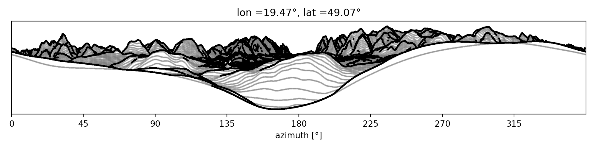
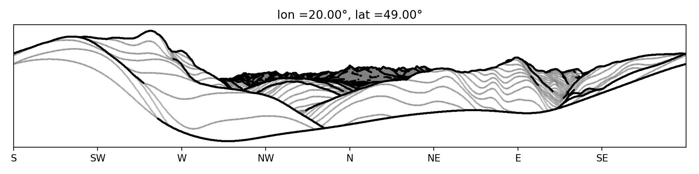

# Horyzon

Horyzon is a topographic library which can compute field of view for any place on Earth and make panoramatic plots such 
as this view on High and Low Tatras in Slovakia: 

 

Horyzon currently uses Global Multi-Resolution Topographic data (GMRT) from https://www.gmrt.org/ .  

## Getting Started


### Prerequisites

Horyzon depends on common libraries such as pandas, xarray, requests. Optionally, 
[pyresample](https://github.com/pytroll/pyresample) can be used to transform data to a different geographic projection. 

### Installing

Clone Horyzon from gitlab

```
git clone https://gitlab.com/jakub.seidl/horyzon 
```

and use GMRT MapTool https://www.gmrt.org/GMRTMapTool/ to download data in your region of interest. 
Save the grid data in GMT v3 Compatible NetCDF format. Automatic data download is envisaged for future versions.

### Usage

1. Download topographic data from https://www.gmrt.org/GMRTMapTool/
2. Load the data as xarray.DataArray

 ```
 from horyzon.data import load_grt  

 alt = load_grt(path_to_the_data)
 ```
 
3. Plot panoramatic view rotated by 90°

```
import horyzon.visibility as vis

lon, lat = 20, 49
vis.plot_panorama(alt, (lon, lat), rotate=90) 
```

4. And voilà ...

